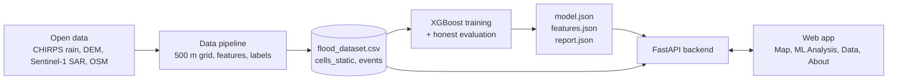

# Predictive Flood Alert System (n2m-rain-model)

Neighbourhood-level flood risk scoring for Bengaluru from rainfall and terrain, using an explainable machine-learning model.

**Team N²M · 1BCP308 Community Project · Dayananda Sagar College of Engineering, Bengaluru**

**Live prototype:** https://n2m-rain-model.onrender.com *(free hosting: the first load can take about a minute while the service wakes up)*

> **Important: the current model is trained on synthetic data.**
> The prototype demonstrates the full architecture (data, model, API, web app), but its predictions are **not real flood forecasts** and will not match the documented 2022 floods. Real data is being prepared by the data pipeline team. This research prototype must never replace official directives from KSNDMC, BBMP or emergency agencies.

---

## Contents

1. [What it does](#what-it-does)
2. [How it works](#how-it-works)
3. [Repository structure](#repository-structure)
4. [Quick start](#quick-start)
5. [Web app pages](#web-app-pages)
6. [API](#api)
7. [The model](#the-model)
8. [The data](#the-data)
9. [Documented flood zones](#documented-flood-zones)
10. [Team](#team)
11. [Roadmap](#roadmap)
12. [Limitations and responsible use](#limitations-and-responsible-use)
13. [Acknowledgements and references](#acknowledgements-and-references)
14. [License and contact](#license-and-contact)

---

## What it does

Bengaluru floods during intense monsoon storms (for example 5 May 2022 and 5 to 7 September 2022), and the flooding is highly local. City-wide rain alerts exist, but they cannot say which neighbourhood is at risk.

This project estimates, for each 500 m cell of the city, how likely it is to flood given **recent rainfall** and the cell's **terrain and drainage**. You enter ten daily rainfall values and the system returns a **relative risk index** (Low, Moderate, High or Severe) for each mapped zone, together with the features that pushed the score up or down.

It also publishes its own data, method and evaluation results so that anyone can audit it.

## How it works



1. **Data pipeline.** Rainfall (CHIRPS), terrain (Copernicus DEM), radar (Sentinel-1) and OpenStreetMap data are turned into one table: a row for every 500 m cell on every wet day, with a flood label, the evidence behind it and a confidence grade.
2. **Model.** An XGBoost classifier is trained and evaluated on **storms and wards it has never seen** (never random row splits).
3. **API and app.** A FastAPI service loads the model, scores rainfall scenarios and explains each score. The same service serves the four web pages.

Full diagrams (architecture, data pipeline, ML flowchart, sequence, data model, deployment) are in the Review 2 document and in `docs/img/`.

## Repository structure

```
n2m-rain-model/
├── backend/        FastAPI app, requirements.txt, zone_features.json
├── data/           flood_dataset.csv, DATA_STATUS.json
├── docs/           index.html, ml.html, data.html, about.html, css/, js/, img/
├── model/          make_mock_dataset.py, train_real.py, trained model + features.json + report
├── references/     Dataset specification, technical study, reference material
├── reports/        Review documents
└── README.md
```

> Folder contents follow the project design. If your layout differs, adjust the paths in the commands below.

## Quick start

**Requirements:** Python 3.10 or newer (and git).

```bash
# 1. Get the code
git clone https://github.com/nishanth-end/n2m-rain-model.git
cd n2m-rain-model

# 2. Create a virtual environment
python -m venv .venv
source .venv/bin/activate          # Windows: .venv\Scripts\activate

# 3. Install dependencies
pip install -r backend/requirements.txt

# 4. Create the synthetic dataset (writes flood_dataset.csv, the real schema with fake values)
python model/make_mock_dataset.py

# 5. Train and evaluate the model (writes the model, features.json and the evaluation report)
python model/train_real.py flood_dataset.csv

# 6. Start the app (API and pages together)
uvicorn backend.app:app --reload
```

Then open **http://127.0.0.1:8000** in your browser.

If `flood_dataset.csv` is written to the folder you ran the command from, move it into `data/` so the backend can find it.

## Web app pages

| Page | What it shows |
|------|---------------|
| **Map** (`index.html`) | The documented flood zones on a Leaflet map. Enter 10 daily rainfall values (or pick a preset) and markers recolour by predicted risk band. A ranked "zones by risk" list sits beside the map. Red rings mark documented flood zones and green rings mark contrast zones, so predicted and documented status can be compared. |
| **ML Analysis** (`ml.html`) | The training pipeline as a block diagram, PR-AUC against chance, POD, FAR and CSI, per-event results, feature importance, known limitations, and a live scorer that explains each score with per-feature contributions. |
| **Data** (`data.html`) | Dataset status (synthetic or real), provenance, the column dictionary, summary statistics, a paginated and filterable table of rows, and a CSV download. |
| **About** (`about.html`) | Project summary, problem statement, team, data sources, roadmap and ethics. |

## API

| Method and path | Purpose |
|-----------------|---------|
| `GET /api/health` | Service status |
| `GET /api/zones` | The mapped zones and the dataset cell matched to each |
| `POST /api/predict` | Score one zone from 10 rainfall values |
| `POST /api/predict_all` | Score all zones for the same rainfall |
| `GET /api/model_report` | Evaluation results and model configuration |
| `GET /api/data` | Paginated, filterable dataset rows |
| `GET /api/data/summary` | Dataset summary and status |
| `GET /api/data/columns` | Column dictionary |
| `GET /download/flood_dataset.csv` | Full dataset download |

**Example request**

```bash
curl -X POST http://127.0.0.1:8000/api/predict_all \
  -H "Content-Type: application/json" \
  -d '{"rainfall_10d": [0,0,2,5,0,12,30,45,60,80]}'
```

Rainfall is in millimetres, **oldest day first**. The API requires exactly 10 numbers between 0 and 500 and returns a clear error otherwise. The interactive API documentation is at `/docs` when the server is running (FastAPI default).

## The model

**Algorithm:** XGBoost classifier on a flat table of one row per 500 m cell per day.

**Inputs (12 candidate features, used when present in the data):**
rainfall (1-day, 3-day, 7-day and maximum hourly), elevation, slope, topographic wetness index (TWI), flow accumulation, impervious fraction, distance to drain, distance to road, and number of lakes within 1 km.

**Training choices**

- Only **wet days** are used (3-day rainfall of at least 10 mm), because dry days are trivially negative.
- Flood **events** are found automatically: positive dates within 3 days of each other count as one storm.
- Positive labels are **weighted by confidence** (high 1.0, medium 0.7, low 0.4), because radar under-detects shallow urban flooding.
- Class imbalance is handled with `scale_pos_weight`.
- Settings: 200 trees, depth 3, learning rate 0.05, subsample 0.8, `min_child_weight` 3 (shallow trees guard against overfitting when few storms exist).

**Evaluation (never random splits)**

| Test | Question it answers |
|------|---------------------|
| **Leave-one-event-out** | Does the model work on a storm it never saw? (training excludes that storm plus a 7-day buffer) |
| **Ward-grouped 5-fold CV** | Does it work in places it never saw? |

**Metrics:** PR-AUC against the chance rate, and POD (hit rate), FAR (false alarm ratio) and CSI at the threshold that maximises CSI. Accuracy and ROC-AUC are avoided because floods are rare and they flatter a model that always predicts "no flood".

**Reading the output.** The score is a **relative risk index, not a probability**. Class weighting and confidence weighting mean it is uncalibrated, so never read it as "% chance of flooding". Each score comes with per-feature contributions (XGBoost `pred_contribs`, SHAP-style, in log-odds): positive values push risk up and negative values pull it down.

**Known limits:** the best-CSI threshold is chosen on the same predictions it is scored on, so it is slightly optimistic and needs confirmation on a final held-out event. `hand_m` and `dist_lake_m` are not used as features at present.

## The data

**Today (synthetic):** 600 random cells over Bengaluru, 3 simulated storms (2020-10-20, 2021-11-18, 2022-09-05) plus 40 background days, giving 25,800 rows. Flood labels come from a made-up formula (`make_mock_dataset.py`). This lets the whole system be built and tested before the real data exists. It uses the **exact column schema** the real data will use.

**Target (real):** about 2,900 cells of 500 m (BBMP area, about 716 km²) over several dated flood events, with:

- continuous daily CHIRPS rainfall and rolling sums computed before rows are selected,
- static features from the DEM, WorldCover and OpenStreetMap,
- Sentinel-1 radar plus dated reports for labels, each with `label_source` and `label_confidence`,
- every cell on every selected day, so the model learns from honest negatives,
- no leaky columns (no hotspot flags, event-day radar values, cause text or after-the-fact elevation labels).

The full column definitions, rules and checks are in the **Flood Dataset Specification** (`model/spec/Flood_Dataset_Specification_for_Member1.docx`). To switch to real data, place the real `flood_dataset.csv` in `data/`, retrain with `train_real.py`, and update `DATA_STATUS.json`.

### Spatial and Temporal Conventions

- **Administrative boundary:** BBMP 2011 delimitation consisting of 198 wards (~716 km²), sourced from DataMeet / OpenCity. Used for the 500 m grid extent and for spatial 5-fold cross-validation.
- **Rainfall definition & temporal alignment:**
  - Day $d$ rainfall is defined on the **UTC day** (00:00:00 to 23:59:59 UTC) from CHIRPS Daily v2.0.
  - Flood labels correspond to local Indian Standard Time (IST, UTC+5:30) observation dates.
  - **Worked example (September 2022 flood):** Heavy rainfall fell primarily during the night of Sunday 4 September through early Monday 5 September 2022 IST. In UTC time, this corresponds to rain on UTC date `2022-09-04` (evening IST) and early `2022-09-05`. The extensive flooding observed across Bellandur, Sarjapur Road, and Whitefield on the morning of 5 September IST is indexed to flood date `2022-09-05`. Multi-day rolling accumulations (`rain_3d_mm`, `rain_7d_mm`) and lag features (`rain_lag1_mm`) explicitly align antecedent evening/overnight rainfall with morning flood outcomes.

## Documented flood zones

The map starts from eight documented places (from the technical study *"Floods at Bengaluru City: A Technical Study"*).

| Zone | Type | Date | Catchment | Documented cause |
|------|------|------|-----------|------------------|
| RBD Layout (Sarjapur Road) | Flood | 2022-09-05 (also 2022-05-05) | 10.1 sq km | Built on or near rajakaluve; raised roads created a low pocket |
| Wipro Campus (Sarjapur Road) | Flood | 2022-09-05 | 11.5 sq km | Road divider and construction blocked the discharge path |
| Outer Ring Road (RMZ Ecospace / Saul Kere) | Flood | 2022-09-05 | 27.9 sq km | Metro rail median wall blocked the overland spill route |
| Epsilon Layout / Yemalur Road | Flood | 2022-09-05 | 191 sq km | Undersized bridge; filled wetland removed a discharge channel |
| Borewell Road (Whitefield) | Flood | 2022-09-07 | 3.3 sq km | Lake breach and removal of an informal stop wall |
| Panathur-Balagere Road | Flood | 2022-09-05 | 209 sq km | Undersized new bridge; barricade blocked spill |
| Malleswaram | Contrast | 2022-09-05 | n/a | Older, higher-elevation core area; not reported as significantly affected |
| Jayanagar | Contrast | 2022-09-05 | n/a | Older, higher-elevation core area; not reported as significantly affected |

The two contrast zones come from general knowledge and are marked "verify". They are not used as the main negatives for training.

## Team

| Member | Role | Focus | GitHub |
|--------|------|-------|--------|
| **Nishanth GM** (1DS25CS161) | Lead Data Engineer / GIS | CHIRPS rainfall, Copernicus DEM, Sentinel-1 SAR extraction, dataset and labels | [nishanth-end](https://github.com/nishanth-end) |
| **Mohith M** (1DS25CS147) | ML Engineer | XGBoost training, evaluation protocol, cross-validation | [mohithm8a017-cmyk](https://github.com/mohithm8a017-cmyk) |
| **Nihal Rao** (1DS25CS160) | Full-Stack Engineer / UI | FastAPI backend, Leaflet map interface, dashboard | [1nihal2](https://github.com/1nihal2) |

**Faculty guide:** Prof. Punith Kumar, Department of Computer Science and Engineering, Dayananda Sagar College of Engineering, Bengaluru.

## Roadmap

- [x] **Review 1: Foundation.** Problem definition, first hotspot dataset (9 points), literature review of the 2022 floods.
- [x] **Review 2: Architecture.** Requirements, system design, technology selection, dataset specification, 500 m grid definition, XGBoost training pipeline, connected prototype on synthetic data.
- [ ] **Review 3: Connected prototype.** Real dataset and retrained model, live rainfall-driven scoring, September 2022 replay.
- [ ] Rainfall forecast API for 24 to 48 hour look-ahead.
- [ ] Alert delivery (Telegram bot). *Planned; scope to be confirmed.*

## Limitations and responsible use

- **Synthetic data:** current outputs are not real forecasts.
- **Relative index:** scores are not probabilities.
- **Coarse inputs:** CHIRPS rainfall is about 5 km, and a 500 m grid cannot see culverts, blocked drains or construction changes.
- **Limited ground truth:** radar misses shallow urban flooding and few documented events exist.
- **Not an official warning system:** follow KSNDMC, BBMP and emergency agency directives.

## Acknowledgements and references

- Sajjan, S. *Floods at Bengaluru City: A Technical Study.*
- Funk, C. et al. (2015). CHIRPS. *Scientific Data*, 2, 150066.
- Chen, T. and Guestrin, C. (2016). XGBoost: A scalable tree boosting system. *KDD*.
- Lundberg, S. and Lee, S.-I. (2017). A unified approach to interpreting model predictions. *NeurIPS*.
- Data: CHIRPS, Copernicus DEM and NASA SRTM, ESA Sentinel-1 (via Google Earth Engine), ESA WorldCover, KSNDMC network.
- Map data © [OpenStreetMap](https://www.openstreetmap.org/copyright) contributors (ODbL). Built with Leaflet, FastAPI, scikit-learn and XGBoost.

## License and contact

**License:** *to be chosen by the team (for example MIT for code and CC BY 4.0 for documentation).*

**Contact:** open an issue on this repository, or reach the maintainers through their GitHub profiles above.
